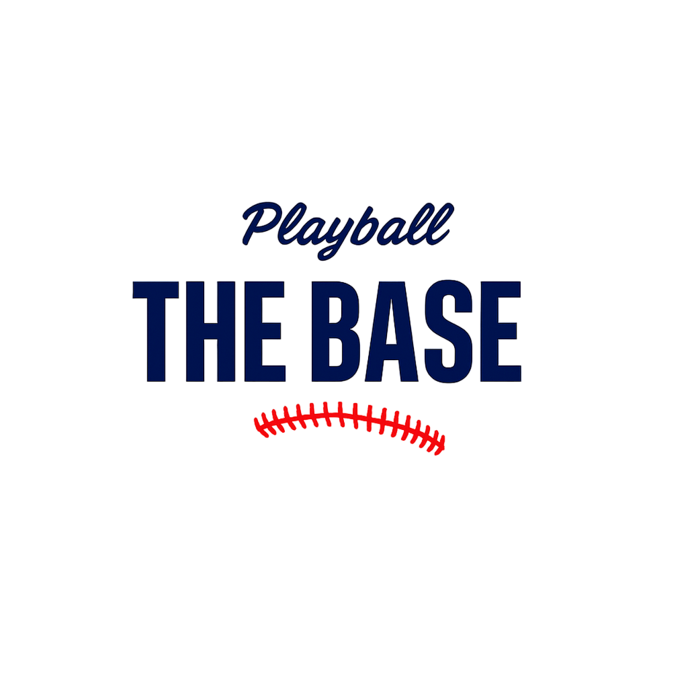

# <h1>
   더베이스
</h1>

**KBO 팬을 위한 팀 중심 야구 커뮤니티 앱**

더베이스는 KBO 팬들이 응원하는 팀을 중심으로  
소통하고, 기록하고, 즐길 수 있도록 설계된 모바일 커뮤니티 앱입니다.

---

## 📱 프로젝트 소개

- 팀 선택 기반 커뮤니티 구조  
- 사진 + 텍스트 중심의 피드  
- 야구 퀴즈, 직관 기록 등 팬 참여형 콘텐츠 제공  
- Flutter로 개발된 크로스플랫폼 모바일 앱

---

## 🛠️ 기술 스택

- **Framework**: Flutter (Dart)  
- **상태 관리**: Provider  
- **Backend**: Firebase  
  - Authentication  
  - Firestore  
  - Firebase Storage  
- **기타**  
  - 소셜 로그인 (Google / Apple / Kakao)  
  - Shorebird를 활용한 앱 패치 관리

---

## ✨ 주요 기능

- **소셜 로그인**
  - Google / Apple / Kakao 계정 연동 로그인
- **팀 기반 커뮤니티**
  - 가입 시 선택한 팀을 기준으로 콘텐츠 노출
- **피드 업로드**
  - 사진 + 텍스트 게시물 업로드
- **야구 퀴즈**
  - 응원가 퀴즈, KBO 관련 퀴즈 제공
- **직관 기록**
  - 경기 관람 기록 및 승률 확인

---

## 🧑‍💻 담당 역할

- Flutter 기반 전체 앱 구조 설계 및 구현  
- Firebase Authentication 연동 및 로그인 플로우 구성  
- Firestore 데이터 구조 설계 및 CRUD 구현  
- Provider 기반 상태 관리 구조 적용  
- UI/UX 흐름 설계 및 화면 구현

---

## 📸 스크린샷
> 추후 추가 예정

---

## 📲 앱 다운로드
- App Store 
 https://apple.co/3WWpDEP
---

## 📌 프로젝트 목적

- Flutter 기반 실전형 모바일 앱 구조 설계 경험
- 커뮤니티 앱에서 필요한 인증, 피드, 상태 관리 패턴 학습
- 실제 서비스 수준의 기능 단위 개발 및 유지보수 경험
